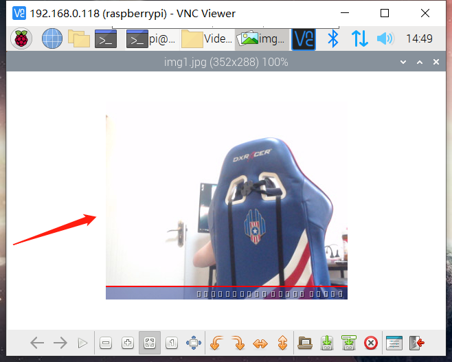

# 一、实验目的
1. Socket通信
2. 多进程、多线程编程
3. 交叉调试目标端程序
4. 磁盘分区与文件系统创建
5. 模块与驱动编程

# 二、实验内容
1. 将树莓派设为智能家居Linux服务器，用来采集环境中的图像信息。
2. 实验中的环境数据存储在特定文件系统中。该文件系统要求具备属性：在线写入、持久性、断电可靠性。
3. PC机、移动设备或另外一个树莓派用作远程客户端，随时请求获取环境数据，客户端和服务器之间采用Socket通信。
4. APP编译采用交叉编译，用gdb-gdbserver交叉调试APP。

# 三、试验过程与结果
**模块安装与scull的实现点击下边连接，我们本次实验使用的是真实摄像头采集环境信息**

[scll和模块驱动编程点我](https://github.com/yiyading/day-read/tree/master/2020530embedded%E7%BB%BC%E5%90%88%E5%AE%9E%E9%AA%8C)

## 1.树莓派实现本地图片视频采取
1. 插入摄像头，查看usb列表

> shell命令：lsusb


2. 查看设备文件，无显示

> shell命令：ls /dev/video\*


3. 解决树莓派摄像头找不到/dev/video*

> 方法：添加摄像头驱动程序 *.ko 文件和对应的raspiberry B3+的硬件使能问题。

（1）在/etc/modules最后一项添加bcm2835-v4l2（注意是4l2，而不是412）<br>


（2）修改Raspberry的启动配置使能项<br>
<br>
<br>
<br>

（3）接下来会弹出如下框图，选择是即可，然后重启即可。<br>


4. 安装fswebcam抓取图片<br>


抓取图片结果如下图：<br>


> shell命令：eog test.jpg	// 可以查看图片

## 2.socket的通信

**socket原理及例程点击下面链接**：

[socket原理和例程点我](https://github.com/yiyading/day-read/tree/master/socket%E9%80%9A%E4%BF%A1%E5%8E%9F%E7%90%86%E5%8F%8A%E4%BE%8B%E7%A8%8B)

在下文源码中，会有在本次实验过程中使用的client和server的源代码


# 四、实验总结

## 1.未解决问题
（1）无法通过socket通信传输图片

## 2.收获
（1）树莓派端实现模块编程

（2）理解并实践驱动文件的作用
# 五、实验源码

client.c
```c
#include <sys/types.h>
#include <sys/socket.h>
#include <stdio.h>
#include <netinet/in.h>
#include <arpa/inet.h>
#include <unistd.h>
#include <string.h>
#include <stdlib.h>
#include <fcntl.h>
#include <sys/shm.h>
 
#define MYPORT  8887
#define QUEUE   20
#define BUFFER_SIZE 1024

int main(){
	// 定义sockfd
	int server_sockfd = socket(AF_INET,SOCK_STREAM, 0);

	///定义sockaddr_in
	struct sockaddr_in server_sockaddr;
	server_sockaddr.sin_family = AF_INET;			// 协议族
	server_sockaddr.sin_port = htons(1234);		// sin_point=0，自动选择一个未占用的端口
	server_sockaddr.sin_addr.s_addr = htonl(INADDR_ANY);	// sim_addr.s_addr置为INADDR_ANY，自动填入本机IP地址
 
	//bind，成功返回0，出错返回-1
	if(bind(server_sockfd,(struct sockaddr *)&server_sockaddr,sizeof(server_sockaddr))==-1){
		perror("bind");
		exit(1);
	}
 
	// listen，成功返回0，出错返回-1
	if(listen(server_sockfd, QUEUE) == -1){
		perror("listen");
		exit(1);
	}
 
	// 客户端套接字
	char buffer[BUFFER_SIZE];
	struct sockaddr_in client_addr;
	socklen_t length = sizeof(client_addr);
 
	//成功返回非负描述字，出错返回-1
	int conn = accept(server_sockfd, (struct sockaddr*)&client_addr, &length);

	if(conn<0){
		perror("connect");
		exit(1);
	}
 
	while(1){
       		memset(buffer,0,sizeof(buffer));
        	int len = recv(conn, buffer, sizeof(buffer),0);
        	if(strcmp(buffer,"exit\n")==0)
            		break;
        	fputs(buffer, stdout);
        	send(conn, buffer, len, 0);
    	}

    	close(conn);
    	close(server_sockfd);
    	return 0;
}
```

client.c
```c
#include <sys/types.h>
#include <sys/socket.h>
#include <stdio.h>
#include <netinet/in.h>
#include <arpa/inet.h>
#include <unistd.h>
#include <string.h>
#include <stdlib.h>
#include <fcntl.h>
#include <sys/shm.h>
 
#define MYPORT  8887
#define BUFFER_SIZE 1024
 
int main()
{
    ///定义sockfd
    int sock_cli = socket(AF_INET,SOCK_STREAM, 0);
 
    ///定义sockaddr_in
    struct sockaddr_in servaddr;
    memset(&servaddr, 0, sizeof(servaddr));
    servaddr.sin_family = AF_INET;
    servaddr.sin_port = htons(1234);  ///服务器端口
    servaddr.sin_addr.s_addr = inet_addr("192.168.0.118");  ///服务器ip
 
    ///连接服务器，成功返回0，错误返回-1
    if (connect(sock_cli, (struct sockaddr *)&servaddr, sizeof(servaddr)) < 0)
    {
        perror("connect");
        exit(1);
    }
 
    char sendbuf[BUFFER_SIZE];
    char recvbuf[BUFFER_SIZE];
    while (fgets(sendbuf, sizeof(sendbuf), stdin) != NULL)
    {
        send(sock_cli, sendbuf, strlen(sendbuf),0); ///发送
        if(strcmp(sendbuf,"exit\n")==0)
            break;
        recv(sock_cli, recvbuf, sizeof(recvbuf),0); ///接收
        fputs(recvbuf, stdout);
 
        memset(sendbuf, 0, sizeof(sendbuf));
        memset(recvbuf, 0, sizeof(recvbuf));
    }
 
    close(sock_cli);
    return 0;
}
```
